# Impedansno upravljanje robotom

Diplomski rad - Implementacija impedansnog upravljanja robotom Franka Emika Panda.

## Preuzimanje i instalacija

### 1. Preuzimanje projekta

```bash
git clone https://github.com/NemanjaManic/impedance-control.git
cd impedance-control
```

### 2. Instalacija Python biblioteka
Koristim Python 3.10.

**Windows:** biblioteka `pinocchio` nema pip wheel za Windows, pa je potrebno conda okruženje:
```bash
conda create -n diplomski python=3.10
conda activate diplomski
conda install -c conda-forge pinocchio
pip install mujoco==3.3.6 robot-descriptions==1.21.0 matplotlib numpy
```

**Linux/Mac:** može i preko običnog venv-a i pip-a:
```bash
python -m venv venv
source venv/bin/activate
pip install -r requirements.txt
```

### 3. Dodavanje objekta (kutije) u scenu

Ukoliko želite da testirate kontakt i interakciju robota sa okolinom, u `panda.xml` fajl je potrebno dodati sledeći objekat (geom) koji je rotiran za 10 stepeni:

```xml
   <body name="box_body" pos="0.6 0.0 0.125" euler="0.1745 0 0">
       <geom name="large_box" type="box" 
             size="0.2 0.4 0.125" 
             rgba="0.8 0.3 0.3 0.7"/>

   </body>
```

### 4. Pokretanje koda
Ukoliko želite da pokrenete scenario, gde je kutija pod nagibom i tu uočite primenu impedansnog upravljanja, pokrenite Panda_ImpedanceControl_Scenario1.
Ukoliko želite da pokrenete scenario, gde primenom neke sile posmatrate kako se robot ponaša podešavanjem parametara impedanse, pokrenite Panda_ImpedanceControl_Scenario2.
```bash
python Panda_ImpedanceControl_Scenario1.py
python Panda_ImpedanceControl_Scenario2.py
```

## Struktura projekta

* **Panda_ImpedanceControl_Scenario1.py** - Scenario1
* **Panda_ImpedanceControl_Scenario2.py** - Scenario2
* **Funkcije.py** - Pomoćne funkcije
* **requirements.txt** - Lista potrebnih biblioteka

## Opis

Implementacija impedansnog upravljanja robota Franka Emika Panda koji će prilagođavati svoje ponašanje u kontaktu sa okolinom. Ovaj rad obuhvata i proučavanja parametara impedanse.

## Medicinske primene

Rad je urađen u okviru studija Biomedicinskog inženjerstva, pa je impedansno upravljanje razmatrano i kroz prizmu primena u medicini i asistivnoj robotici, gde je bezbedan i predvidiv kontakt sa pacijentom ključan zahtev.

* **Kontaktni zadaci u medicini** - Klasični primeri zadataka gde end-effector robota mora da ostvari kontakt sa okolinom (poliranje, zavarivanje, montaža) u medicini imaju svoj analogon u zadacima poput **ubacivanja sonde ili igle**, gde pozicijsko upravljanje nije pouzdano zbog nepoznatih mehaničkih svojstava tkiva, dok impedansno upravljanje omogućava prilagodljiv i bezbedan prodor.
* **Saradnja čoveka i robota (safe human-robot interaction)** - Raspregnuta impedansa, ostvarena zahvaljujući merenju sile senzorom u ručnom zglobu, posebno je značajna u zadacima kolaborativne robotike. Zbog toga je impedansno upravljanje steklo široku primenu u biomedicinskom inženjerstvu, gde je ključno obezbediti siguran kontakt sa pacijentima i njihovom okolinom.
* **Robotska rehabilitacija** - Impedansno upravljanje se koristi za rehabilitaciju gornjih ekstremiteta kod pacijenata sa neuromotornim deficitom, kao i u ROS-baziranim rehabilitacionim sistemima zasnovanim na principu "assist-as-needed" (robot pomaže pacijentu samo onoliko koliko je neophodno, ostavljajući mu prostor da sâm ostvari pokret).
* **Hirurška navigacija** - Treći slučaj drugog scenarija (kruta orijentacija i z-pozicija, meka pozicija u x-y ravni) direktno oslikava konfiguraciju koja se koristi kod robota za navigaciju u hirurgiji, gde hirurg vodi instrument u unapred definisanoj ravni uz stabilan i kontrolisan rez - kruto upravljanje obezbeđuje preciznost duž ose reza, dok mekša kontrola u ravni dozvoljava prirodnije, bezbednije vođenje instrumenta.

## Rezultati i diskusija

U ovom poglavlju su prikazani rezultati impedansnog upravljanja robotom za dva različita scenarija, kako bi se ocenila pouzdanost i prilagodljivost predloženog kontrolera u različitim uslovima rada.

### Prvi scenario

Ispred robota se nalazi objekat (kutija) na čijoj gornjoj površini je definisana trajektorija u obliku pravougaonika koju robot treba da prati u operacionom prostoru, u kontaktu sa površinom. Sistem "veruje" da je površina horizontalna, dok je ona u simulaciji nagnuta pod uglom od 10° u odnosu na pod — željena trajektorija je ustvari ofsetovana unutar materijala objekta, čime se u sistem unosi nepoznat poremećaj koji kontroleru nije eksplicitno poznat. Cilj je ispitivanje ponašanja robota pri kontaktu sa okolinom.

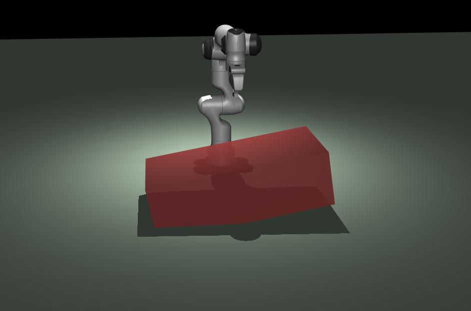

*Slika 5.1. Robot FEP i geometrijski objekat (kutija pod nagibom) kao uneti poremećaj, u MuJoCo viewer-u.*

**Snimak simulacije:**

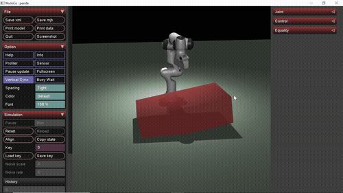

([preuzmi video u punom kvalitetu](videos/scenario1.mp4))

Impedansni kontroler je podešen preko veze sa sistemom drugog reda:

| Matrica | Translatorno (x, y, z) | Jedinica | Rotaciono (x, y, z) | Jedinica |
|---|---|---|---|---|
| Krutost (Km) | 10000, 10000, 7900 | N/m | 500, 500, 500 | N·m/rad |
| Prirodna nepr. učestanost (ωn) | 10, 10, 1.8 | rad/s | 10, 10, 10 | rad/s |

Faktor relativnog prigušenja je ζ = 1.2 za translatorno i rotaciono kretanje, dok su matrice inercije (Hm) i prigušenja (Dm) dobijene iz ωn i ζ. Putanja je pravougaonik u horizontalnoj ravni sa sto tačaka po segmentu, sintetisan polinomom petog reda između svake dve susedne karakteristične tačke. Podaci sa senzora sile su transformisani u bazni koordinatni sistem, statički kompenzovani za gravitaciono opterećenje hvataljke, i filtrirani pokretnom srednjom vrednošću (najbolji rezultat sa prozorom od 200 uzoraka).

<p float="left">
  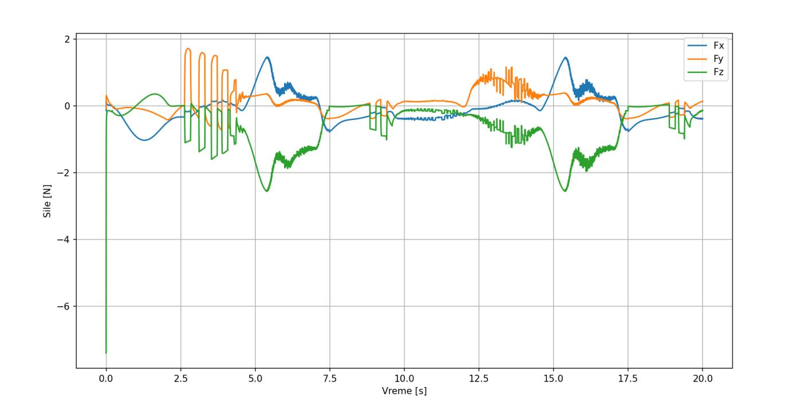
  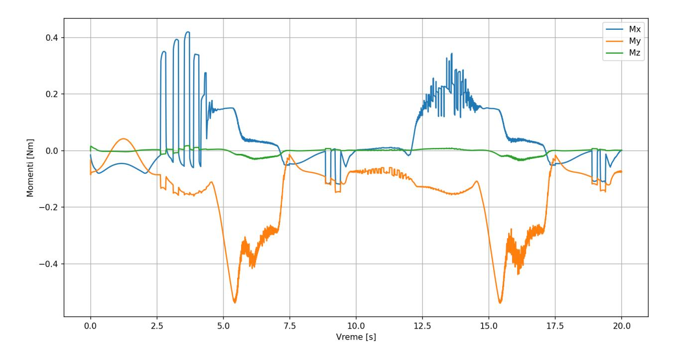
</p>

*Slika 5.2. i 5.3. Sile i momenti sa senzora sile tokom praćenja putanje.*

Hvataljka je bila upravna na kutiju, pa je najizraženija sila po z-osi — njeno povećanje javlja se u trenutku stupanja u kontakt, nakon čega dolazi do kratkotrajnih oscilacija usled elastičnog kontakta. Sila po y-osi takođe dobija značajne vrednosti zbog nagiba kutije (veća pri kretanju uz nagib, manja niz nagib), dok se sila po x-osi javlja pri prelasku između nagnutih delova površine. Najveće vrednosti momenta beleže se oko x-ose (u skladu sa silama po y i z osi), moment oko z-ose ostaje približno nula.

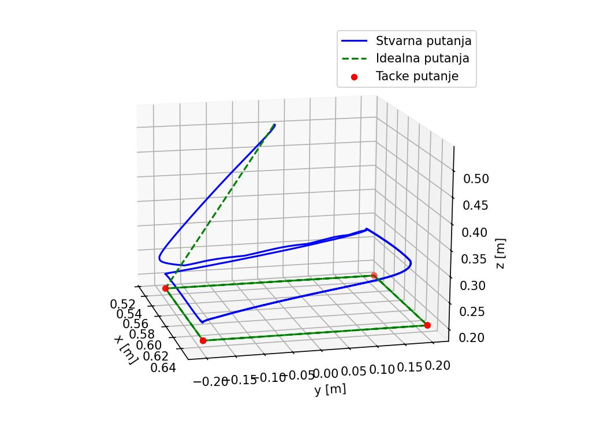

*Slika 5.4. Stvarna i idealna putanja vrha robota tokom trajanja simulacije.*

Robot se prilagodio unetom poremećaju, ali stvarna putanja odstupa od idealne ne samo po osi upravnoj na površinu već i po ostalim osama — to je i mana ovog pristupa: potrebno je napraviti balans između aktivnih parametara impedanse. Veće vrednosti matrice inercije, a manje vrednosti matrice krutosti, dovode do mekšeg kontakta ali i većeg odstupanja po pojedinim osama.

### Drugi scenario

Drugi scenario prikazuje uticaj različitih izbora parametara kontrolera na dinamičko ponašanje sistema. Robot drži fiksnu poziciju (0.4, 0.0, 0.4) i orijentaciju (RPY = (−π, 0, 0)), dok mu se sekvencijalno, kao pravougaoni impulsi u trajanju od 2 s (sa 2 s razmaka), zadaju spoljašnje sile (10 N) i momenti (2 N·m) redom po X, Y, Z, Mx, My, Mz osi. Ukupno trajanje simulacije je 30 s. Razmatraju se tri slučaja izbora aktivnih parametara kontrolera (heuristički odabranih).

**Slučaj 1 — kruta pozicija, meka orijentacija**

| Matrica | Translatorno (x, y, z) | Jedinica | Rotaciono (x, y, z) | Jedinica |
|---|---|---|---|---|
| Inercija (Hm) | 14000, 14000, 14000 | kg | 90, 90, 90 | kg·m² |
| Krutost (Km) | 50, 50, 50 | N/m | 1, 1, 1 | N·m/rad |
| Prigušenje (Dm) | 2000, 2000, 2000 | N·s/m | 12.5, 12.5, 12.5 | N·s·m/rad |

<p float="left">
  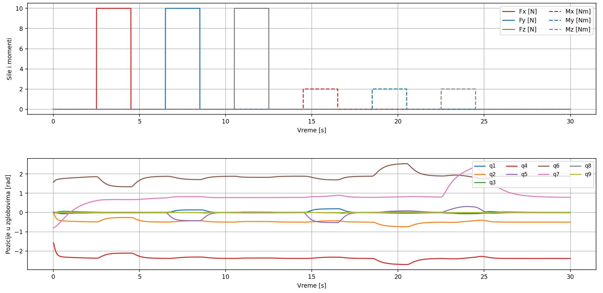
  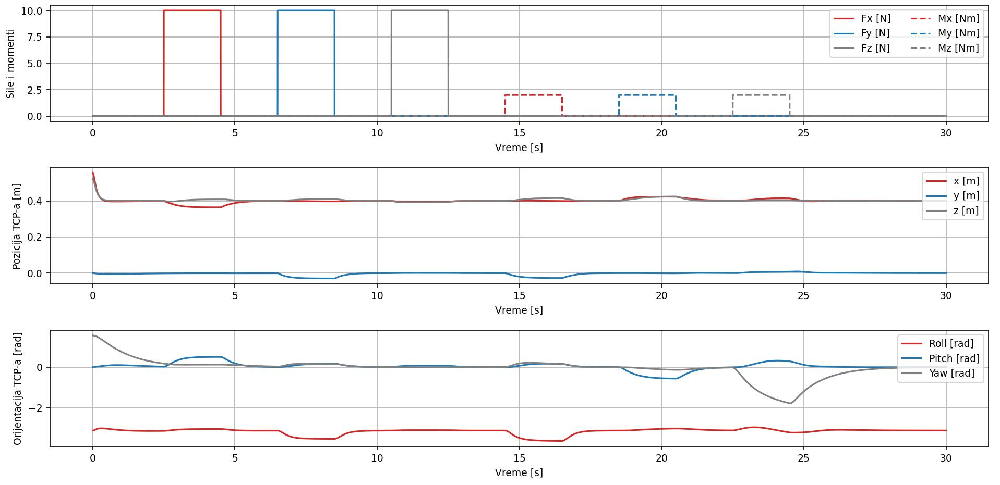
</p>

*Slika 5.5. i 5.6. Uticaj sile i momenata na pozicije zglobova, i na poziciju/orijentaciju vrha robota — slučaj 1.*

**Snimak simulacije:**

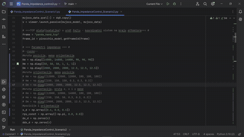

([preuzmi video u punom kvalitetu](videos/scenario2_slucaj1.mp4))

Veće oscilacije u pozicijama zglobova javljaju se nakon delovanja momenata, što je očekivano zbog meke orijentacije. Sile i momenti izazivaju veće poremećaje u orijentaciji, dok se pozicija menja u veoma malom opsegu.

**Slučaj 2 — kruta orijentacija, meka pozicija**

| Matrica | Translatorno (x, y, z) | Jedinica | Rotaciono (x, y, z) | Jedinica |
|---|---|---|---|---|
| Inercija (Hm) | 12000, 12000, 12000 | kg | 180, 180, 180 | kg·m² |
| Krutost (Km) | 150, 150, 150 | N/m | 0.3, 0.3, 0.3 | N·m/rad |
| Prigušenje (Dm) | 2000, 2000, 2000 | N·s/m | 12.5, 12.5, 12.5 | N·s·m/rad |

<p float="left">
  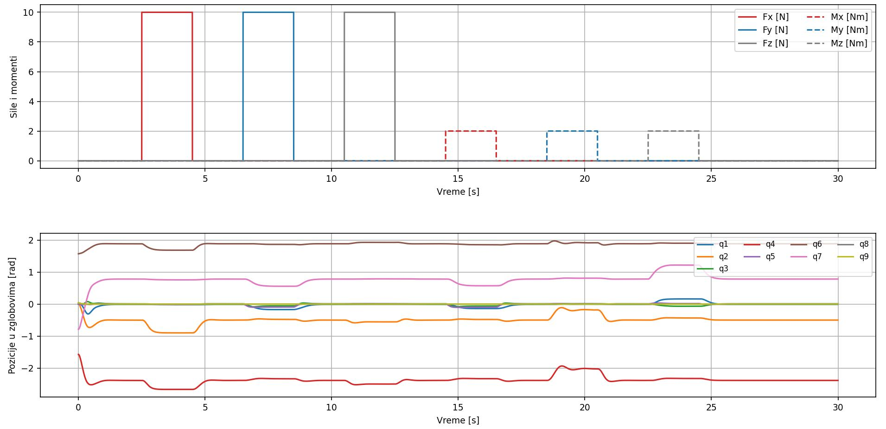
  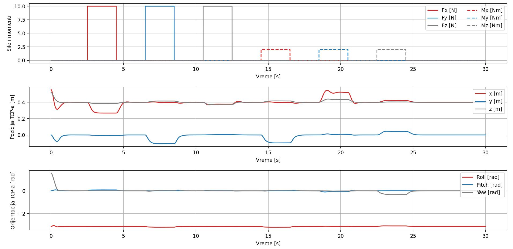
</p>

*Slika 5.7. i 5.8. Uticaj sile i momenata na pozicije zglobova, i na poziciju/orijentaciju vrha robota — slučaj 2.*

**Snimak simulacije:**

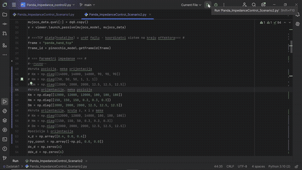

([preuzmi video u punom kvalitetu](videos/scenario2_slucaj2.mp4))

Oscilacije u pozicijama zglobova pri delovanju momenata su manje nego u prvom slučaju. Pozicija se sada primetno menja (skoro 20%) u trenucima delovanja sila i momenata, nešto značajnije po x i y osi.

**Slučaj 3 — kruta orijentacija i z-pozicija, meka pozicija u x-y ravni**

Ovakva konfiguracija (kruto po orijentaciji i po jednoj osi, meko u ravni) često se koristi kod robota za navigaciju i u hirurgiji, gde hirurg vodi instrument u unapred definisanoj ravni uz stabilan i kontrolisan rez.

| Matrica | Translatorno (x, y, z) | Jedinica | Rotaciono (x, y, z) | Jedinica |
|---|---|---|---|---|
| Inercija (Hm) | 12000, 12000, 14000 | kg | 180, 180, 180 | kg·m² |
| Krutost (Km) | 150, 150, 50 | N/m | 0.3, 0.3, 0.3 | N·m/rad |
| Prigušenje (Dm) | 2000, 2000, 2000 | N·s/m | 12.5, 12.5, 12.5 | N·s·m/rad |

<p float="left">
  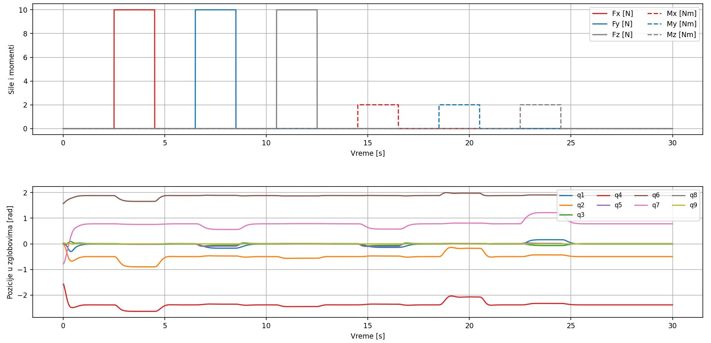
  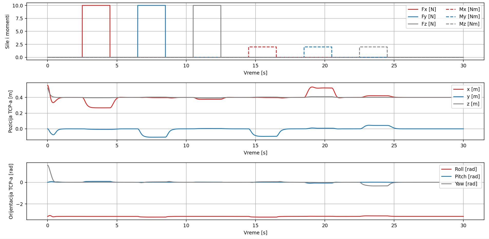
</p>

*Slika 5.9. i 5.10. Uticaj sile i momenata na pozicije zglobova, i na poziciju/orijentaciju vrha robota — slučaj 3.*

**Snimak simulacije:**

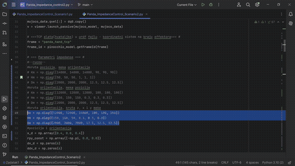

([preuzmi video u punom kvalitetu](videos/scenario2_slucaj3.mp4))

Veća nestabilnost u zglobovima izazvana je delovanjem sila po x i y osi. Oscilacije pozicije po z-osi su zanemarljive (potvrđuje stabilnost krute kontrole u tom pravcu), dok su pomaci u x-y ravni izraženiji, što ukazuje na povećanu osetljivost sistema u tim pravcima usled mekše kontrole.

### Zaključak

Analiza pokazuje da izbor parametara impedanse direktno utiče na dinamičko ponašanje sistema — podešavanjem je moguće postići kruto upravljanje za precizno praćenje putanje, ili meku, prilagodljivu interakciju za bezbednu komunikaciju sa okolinom. Postoji, međutim, kompromis između stabilnosti, preciznosti i prilagodljivosti: male vrednosti matrice krutosti u odnosu na inerciju i prigušenje čine sistem osetljivim na šumove i sklonim oscilacijama, dok prevelike vrednosti matrice inercije vode ka značajnom odstupanju položaja/orijentacije. Visoke vrednosti prirodne neprigušene učestanosti za rotaciono kretanje dodatno mogu dovesti do nestabilnosti.

